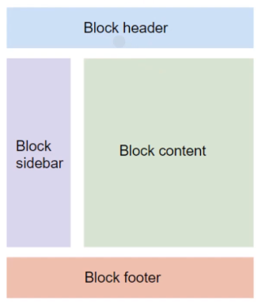

### 仮想環境をつくる

```bash
$ python3 -m venv venv
```

### 仮想環境を立ち上げる

```bash
$ source venv/bin/activate
```

### Django インストール

```bash
$ pip install django
```

### Start Project

```bash
$ django-admin startproject todoproject .
```

### Create App

```bash
$ python manage.py startapp todo
```

### todoproject/settings.py

```python
TEMPLATES = [
...
'DIRS': [BASE_DIR / 'templates'],
...
]
```

### manage.py と同じ階層に templates ディレクトリをつくる

```bash

$ mkdir templates
```

### todoproject/settings.py に App を追加

```python
INSTALLED_APPS = [
...
'todo.apps.TodoConfig',
]
```

### todoproject/urls.py で url の繋ぎ込み

```python
from django.contrib import admin
from django.urls import path, include

urlpatterns = [
path('admin/', admin.site.urls),
path('', include('todo.urls'))
]
```

### todo ディレクトリに urls.py をつくる

```bash
$ touch urls.py
```

### todo/urls.py に admin 追加

```python
from django.contrib import admin
from django.urls import path, include

urlpatterns = [
path('admin/', admin.site.urls),
]
```

### サーバ立てる

```bash
$ python manage.py runserver
```

### Migration files つくる

```bash
$ python manage.py makemigrations
```

or

```bash
$ python manage.py makemigrations todo
```

### データベースへの書き込み(migrate 実行、テーブル作成)

```bash
$ python manage.py migrate
```

### superuser を作成

```bash
$ python manage.py createsuperuser
```

### CRUD 機能テンプレート

Create : CreateView<br>
Read: ListView, DetailView<br>
Update: UpdateView<br>
Delete: DeleteView<br>

### CRUD-R ListView

```python
 : 複雑な処理
{{}} : データ
```

### CRUD-R DetailView

##### パスで PK を指定<br>

```python
urlpatterns = [
...
path('detail/<int:pk>', TodoDetail.as_view())
]
```

### CRUD-C CreateView

##### パスを指定<br>

```python
urlpatterns = [
...
path('create/', TodoCreate.as_view())
]
```

##### form タグの中

```python

```

### CRUD-D DeleteView

##### パスで PK を指定<br>

```python

urlpatterns = [
...
path('delete/<int:pk>', TodoDelete.as_view(), name='delete')
]
```

### CRUD-U UpdateView

##### パスで PK を指定<br>

```python

urlpatterns = [
...
path('delete/<int:pk>', TodoDelete.as_view(), name='delete')
]
```

### templates(html ファイルを使い回す)



### a タグボタンの href=""に url を設定

##### ""

```python
編集画面 
削除画面 
詳細画面 
```
